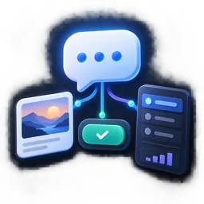
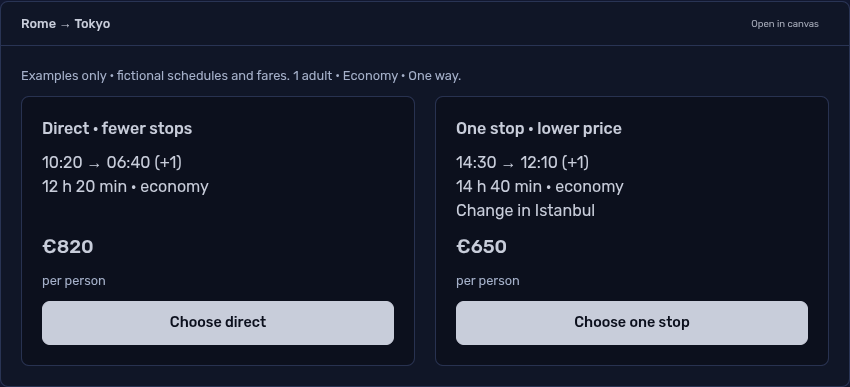
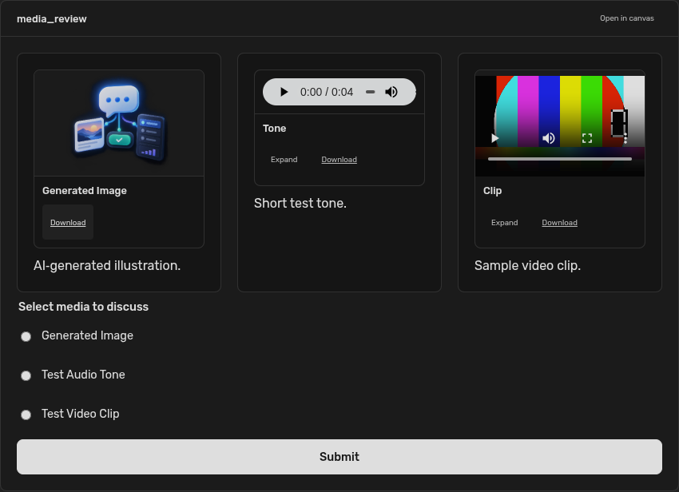

# a2ui-zero

Rich answers that belong in Agent Zero: interactive cards, images, audio, video, comparisons,
forms, and choices in chat, with room for larger views in the right canvas.





## Try it

- “Show two illustrative flight options from Rome to Tokyo as interactive cards.
  Let me choose direct or one stop. Don't book anything.”
- “Give me a visual Kyoto guide with a photograph and choices for what to explore.”
- “Ask me for a destination, interests, date and daily budget in an interactive
  form, then use my answers to plan a day.”
- “Keep this comparison open in the canvas while we discuss it.”

The agent uses its existing configured model and research tools. A2UI adds the
presentation and interaction; it does not supply flight inventory, photos, or
booking services. Choices send ordinary user messages. Form submissions include
readable labels and entered values. They do not directly execute agent tools.

## Install

Requires an Agent Zero build with community plugins, the `set_messages_after_loop`
WebUI hook, native canvas surfaces, and its existing `jsonschema` dependency.
Install [this repository](https://github.com/3clyp50/a2ui-zero) through
**Plugins → Add plugin** using its URL, or upload a plugin ZIP. Refresh the WebUI
and start a new chat so the agent receives the tool instructions. There are no
new packages, service keys, servers, CDN scripts, or manual Execute steps.

The display/repository name is **a2ui-zero**. Agent Zero's required runtime name
is **a2ui_zero**, installed in `/a0/usr/plugins/a2ui_zero`.

## What is supported

The plugin consumes real **A2UI v0.9.1** envelopes with the custom catalog
`urn:a2ui-zero:catalog:1`. The catalog is supplied locally, never fetched from an
agent-provided URL. Its schema is in [schema/catalog.json](schema/catalog.json).

| Purpose | Components |
| --- | --- |
| Layout | Column, Row, List, Card, Divider |
| Content | Text, Image, Icon, Link |
| Media | Audio, Video |
| Choices | Button, ChoicePicker |
| Forms | TextField, CheckBox, DateTimeInput, Slider |
| Workspace | CanvasPanel |

`CanvasPanel` opens another named UI surface in Agent Zero's native canvas.
Every inline surface also offers **Open in canvas**. The canvas has a view
selector and uses the host's docking, floating-window and mobile controls.
Colors, typography, spacing, borders, focus rings and controls inherit Agent
Zero's design tokens, including light mode.

Comparison cards stretch evenly within a Row and stack when the available width
gets narrow. Use a Column inside each Card, ending with a Button or a Column/Row
of summary details and actions; that footer anchors to the bottom automatically.
This keeps prices and choices aligned without fixed heights or clipped text.

The examples are authoring references, not fixed workflows. The agent composes
and updates these components at runtime. A questionnaire can combine several
radio or checkbox groups with separate text fields for custom answers, then
submit them together. Conditional fields require an agent update; choosing
"Other" does not automatically reveal a text field.

## Media previews



Images, audio, and video play directly in rich chat cards, including files created
by generation tools. Image cards open Agent Zero's existing zoom/pan viewer.
Audio and video use native playback controls and can expand in the native modal
shell. The same A2UI components also work in the right canvas.

Ordinary assistant replies containing media file links receive inline preview
cards automatically, without another model call. Existing Markdown images keep
their native preview and image viewer. Text, scripts, and code retain their
existing file and Editor behavior.

- `Image`: `url`, `alt`; optional `caption` and `fit` (`contain` or `cover`).
- `Audio`: `url`, `title`; optional `caption`.
- `Video`: `url`, `title`; optional `caption` and `poster` (an image source).

Sources may be HTTP(S) URLs or existing files inside `/a0`, such as
`/a0/usr/workdir/output.mp4`, `file:///a0/usr/uploads/recording.wav`, or
`img:///a0/usr/workdir/generated.png`. Standard Agent Zero image/download links
are also recognized. URL and poster fields support data-model bindings.
Use actual output paths from tools; the plugin does not generate media itself.

Local files stream through an authenticated, media-only endpoint with byte-range
support for seeking. Files outside `/a0`, including escaping symlinks, are rejected.
Playback starts only on user interaction; opening an expanded player pauses its
inline counterpart, and closing it releases playback.

Recognized formats: JPEG, PNG/APNG, GIF, BMP, WebP, AVIF, SVG/SVGZ, ICO;
MP4, WebM, OGV, MOV; MP3, WAV, FLAC, AAC, M4A, OGG, and Opus. OGG defaults to
audio; use an explicit `Video` component for an Ogg video. Playback depends on
the browser's codecs; unsupported files keep an original-file link. No transcoder,
external player, autoplay, HTML, PDF, or code preview is added.

## Agent tool

`a2ui` accepts `action: "show"`, a plain-text fallback `text`, and `messages`.
Optional arguments: `title`, `placement: "chat" | "canvas"`, and
`open_in_canvas: true`. `show` completes the turn. `action: "inspect"` reads this
chat's current surface state without ending the turn.

Supported messages: `createSurface`, `updateComponents`, `updateDataModel`, and
`deleteSurface`. Use one `root` component per surface. Create a surface once;
later messages can replace components by ID or replace/delete data at a JSON
Pointer. Forward component references render when their definitions arrive.

Complete tool arguments:
[flight comparison](examples/flights.json), [place guide](examples/place-guide.json),
[trip brief](examples/trip-brief.json).

`Button.action.event` uses `name: "user_message"` and
`context: {"message": "The user's readable request"}`. Its message is shown in
the button tooltip. Local form edits update bound text immediately. Submitting
validates against the saved component definitions and current revision, then
uses Agent Zero's normal send/queue behavior. The composer draft and attachments
are preserved; a choice never moves to a different chat.

## Persistence and boundaries

- Current surfaces live in Agent Zero's persisted chat context; response logs
  retain snapshots for history replay and exported chats. The canvas shows the
  latest state. Older chat responses remain historical snapshots; stale choices
  are rejected. Deletion removes the current surface, preserving the transcript.
- Local form edits are shared between chat and canvas while mounted. They are
  discarded on a new server revision, chat switch or page reload. Submit them
  before leaving if the agent should remember them.
- Form values enter ordinary chat messages. There is no password/secret input
  component or private credential handoff to terminal tools; do not use these
  forms to collect credentials.
- Supports this custom catalog, not the entire upstream Basic Catalog. Static
  child references and JSON Pointer bindings are supported; template child lists,
  arbitrary client functions, custom themes, HTML, scripts and iframes are not.
  `sendDataModel` metadata is not used: this transport sends the visible form
  fields as a normal user message. Input bindings must use distinct leaf paths.
- Updates stream through Agent Zero's existing log synchronization after each
  completed tool call. Partial JSON tokens are not rendered.
- Up to 16 surfaces / 500 KB state per chat, 160 component definitions per
  surface, 512 expanded nodes, 24 nesting levels, and 4,000 characters per value.
- Media accepts the sources described above; ordinary Link components accept
  HTTP(S) URLs plus plugin-owned assets. External media is fetched by the browser;
  images use no referrer. Text remains selectable plain text;
  the normal response fallback can still use Agent Zero Markdown.
- Disable/remove through Plugins. Hooks create no external files or processes and
  never alter shared dependencies. Saved chat snapshots remain; the readable
  fallback continues to work without this plugin.

## Development

Use the existing Agent Zero environment:

```bash
conda run --no-capture-output -n a0 python -m unittest discover -s tests -v
node tests/renderer.test.mjs
```

For the streaming API check, run inside the installed Agent Zero framework:

```bash
cd /a0/usr/plugins/a2ui_zero
PYTHONPATH=/a0 /opt/venv-a0/bin/python tests/check_media_api.py
```

See the [implementation plan](docs/PLAN.md), [verification report](docs/VERIFICATION.md),
and [artwork provenance](docs/ARTWORK.md). Plugin code is MIT licensed; the two
upstream A2UI schemas retain their Apache 2.0 license and attribution in
[schema/NOTICE.md](schema/NOTICE.md).

Media preview coverage and inline file-serving approach are adapted from
[keyboardstaff/attachment_preview](https://github.com/keyboardstaff/attachment_preview)
by **Wabifocus (keyboardstaff)**, MIT licensed. Attribution is retained in the
root [LICENSE](LICENSE); the reference revision is
`aae4c890a5fba3d84d0b49ff6f90493ed7b212f6`.
